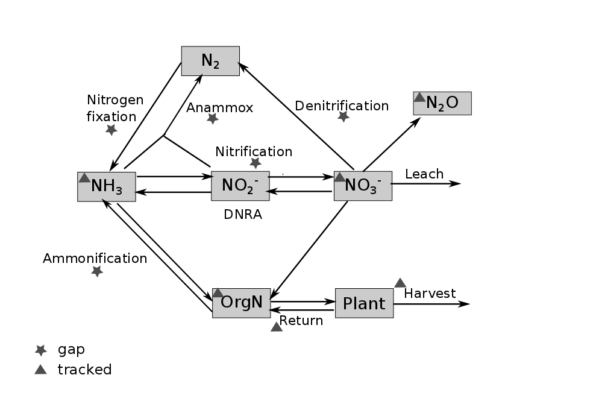

##################################
N Cycle Meeting Discussion Results
##################################

The nitrogen cycle can be measure in two aspects::

Pools
  Concentration or amount of chemical involved in the cycle.

Dynamics
  Kinetics of the processes. Gene markers of enzymes involved in the processes can be used to measure dynamics.

Figure 1 shows a brief N-cycle diagram. Pools that can be currently measured at marked with triangle and gaps (either pools or dynamics) are marked with stars.

   Figure 1. N-cycle.

.. table:: Table 1. Gene markers involved in N-cycle are listed. Those with boldface already have been used.
   +-----------------+-------------+------------------+
   | process         | gene        | function         |
   +=================+=============+==================+
   | |N2| fixation   |**nifH**     | |N2| => |NH3|    |
   +-----------------+-------------+------------------+
   | denitrification |  narG,napA  | |NO3-| => |NO2-| |
   |                 +-------------+------------------+
   |                 |**nirS,nirK**| |NO2-| => NO     |
   |                 +-------------+------------------+
   |                 |**norB**     | NO => |N2O|      |
   |                 +-------------+------------------+
   |                 | nosZ        | |N2O| => |N2|    |
   +-----------------+-------------+------------------+
   | nitrification   | amoA(bac)   | |NH3| => |NH2OH| |
   |                 +-------------+                  +
   |                 | amoA(arc)   |                  |
   |                 +-------------+------------------+
   |                 | hao         | |NH2OH| => |NO2-||
   |                 +-------------+------------------+
   |                 | nxrA        | |NO2-| => |NO3-| |
   +-----------------+-------------+------------------+

As shown in Table 1, genes of key enzymes in |N2| fixation, denitrification, and nitrification are listed. The ones with boldface have already been used to study GLBRC samples. These gene markers can be study in three aspacts:

- gene counts
- expression
- sequence diveristy

.. Substitution def
.. |N2| replace:: N\ :sub:`2`\ 
.. |NH3| replace:: NH\ :sub:`3`\ 
.. |NO3-| replace:: NO\ :sub:`3`\ :sup:`-`\ 
.. |NO2-| replace:: NO\ :sub:`2`\ :sup:`-`\ 
.. |N2O| replace:: N\ :sub:`2`\ O
.. |NH2OH| replace:: NH\ :sub:`2`\ OH

----

--jiarong
