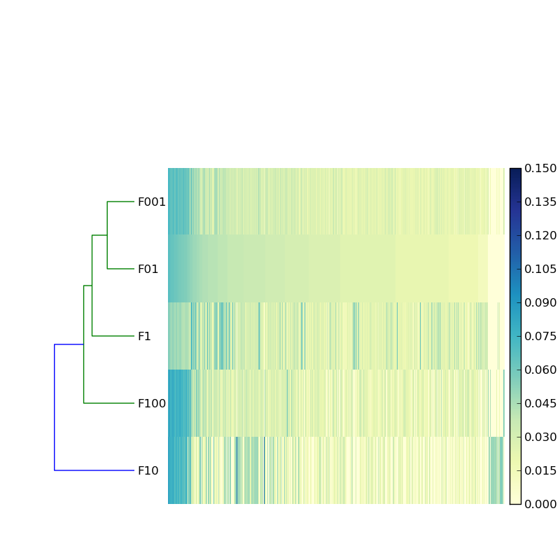
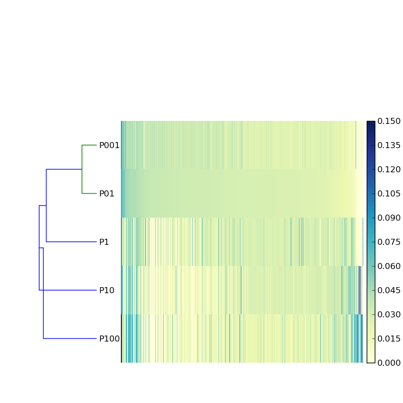

::

  Jiarong, Very nice to get this assembly done on BIG data, even though it
  seems still hugely diverse and most unassembled.  I have a few questions:

  What is the k and c for digital normalization. I know one number is the
  required number before the identical ones are set aside, but which and what
  is the other number? the length required for the repeat?

"k" is the size for kmer (the length of window sliding through reads) and "c" is fold coverage cutoff (the required number before the identical ones are set aside).

::

  The distribution of cpu time seems different than Adina had for the Great
  Prairie, i.e. she had much less for digital normalization and much more for
  artifact removal. Is this due to improvements in the algorithms, data size or
  does it have some biological meaning?

I just checked Adina's poster. The Iowa corn sample has 1.8 billion reads. The amazon forest or pasture samples are about 3 billion reads after preprocess. So digital normalization on my data should take longer time (at least half more). The actifact removal time depends on how much reads left after digital normalization, but generally should be less than digital normalization. Adina's assembly process is a little different. The "artifact removal" you mentioned might be "delump", which is very time consuming. I did not do delump for my biggest partition but just assembled it with big memory. In sum, there is no change in algorithm and biological meaning we can get out of the running time, I think.

::

  How much data was removed with the artifact removal, and with the remaining
  was the portion assembled the same as for the non-lump?

For forest data, 1/4 is remove digital normalization, and 15% removed by artifact removal.

::

  Why the big hump in the forest saturation curve after 1.5. Which sample is
  it, #6,7,8?  Maybe there is something about the sites that can explain it?

Those are the data from Forest 10 meter square (F10). From figure 6 (the heatmap), we can see F10 is most different. I do not know why, maybe people did the soil sampling have some clues.

::

  So 9.3% of the forest contigs were covered by pasture ones, and 3.5% of the
  forest bp covered by ones from pasture? So more of forest history is seem in
  pasture sequence? though the overall amount is  very low. For contig
  coverage, how long and how perfect is the match requirement?

The amount of basepairs shared between forest and pasture take up larger portion in forest just because forest assembly is smaller. *Why the forest data have smaller assembly* is the main question I have now. The conclusion I get here is that the DNA content change a lot after land conversion based on the < 5% similarity. If we want to fit in the "forest history shown in pasture sequence" story, the forest assembly should be close to a subset of pasture. I used bwa's long sequence mapping option (mem), which required a alignment score higher than 30.

::

  Since pasture sequences have more in common ninth each other, why does the
  forest heat map show more darker blue? Are their very dominant sequences more
  in common, and that is not apparent in Fig. 5  because it merges with the
  left axis? Or?

The color bar scale in two heat map are different. Below you can see the revised figures with same color bar scale. Pasture have some very abundant contigs but very few.

It is a good point that pasture sample should be more similar among the samples based on the 16s data. I checked the dissimilarity between the samples using bray-curtis index. As shown in the following table, the variation within pasture samples are similar to the forest samples. One possible explanation is that the contigs longer than 800bp can not represent the whole community.

.. table:: bray-curtis dissimilarity between forest samples based on the coverage of contigs > 800bp. Sum of pdist matrix is 10.782496.

   ======  ======  ======  ======  ======  ======
   Sample  F01     F1      F10     F100    F001
   ======  ======  ======  ======  ======  ======
   F01     0.0000  0.3999  0.7251  0.5186  0.2936
   F1      0.3999  0.0000  0.7385  0.5567  0.3930
   F10     0.7251  0.7385  0.0000  0.6810  0.7109
   F100    0.5186  0.5567  0.6810  0.0000  0.3741
   F001    0.2936  0.3930  0.7109  0.3741  0.0000
   ======  ======  ======  ======  ======  ======

.. table:: bray-curtis dissimilarity between forest samples based on the coverage of contigs > 800bp. Sum of pdist matrix is 11.257510.

   ======  ======  ======  ======  ======  ======
   Sample  P01     P001    P1      P10     P100
   ======  ======  ======  ======  ======  ======
   P01     0.0000  0.2124  0.6787  0.5269  0.6725
   P001    0.2124  0.0000  0.6749  0.5168  0.6315
   P1      0.6787  0.6749  0.0000  0.5885  0.5900
   P10     0.5269  0.5168  0.5885  0.0000  0.5366
   P100    0.6725  0.6315  0.5900  0.5366  0.0000
   ======  ======  ======  ======  ======  ======

::

  The MG-RAST for 800bp should be more useful, at least than for using if for
  the short reads as is often done, It will be interesting thought to see how
  much beyond housekeeping is seen?? Also  to see if genes of unknown taxa are
  common with each other (hence dominant clades though unknown taxa).

The main reason I picked 800bp is that I want higher confidence on gene call, or some part of the contig can be annotated in case of very novel sequence. The downside is the contigs may only represent members that are relatively abundant.
