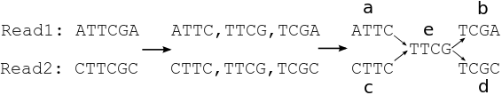

###########################################
Metagenome assembly - Are the contigs real?
###########################################

:Author: Jiarong Guo
:Tags: Metagenomics, Assembly, Chimeric contig
:Date: 2013-07-24
:Slug: asseChi
:Category: Science

with Adina Howe, James Tiedje, and Titus Brown

Background
==========

This is one of my assembly series. In `my other post <http://jiarong.github.io/blog/asseMap.html>`__ about reads mapping back rate, I found more reads only partially mapped to the contigs (about 15%) than those entirely amapped (about 7%), which suggested the *de brujin* graph assembler used (velvet) was putting wrong piecies together and creating chimeric contigs (Figure 1). This results led me to think about how to identify these chimeric contigs.

Two purposes of the post:

- Identify chimeric contigs.
- Make people aware of chimeric contigs from *de brujin* graph assembly.

   Figure 1. *De brujin* graph of two reads sharing one kmer in the middle. Path c -> e -> b and a -> e -> d result in read level chimera.

In shotgun metagenome data, a mixture of genomes are break down into reads by the sequencing method, and the reads are further break down into kmers to build *de brujin* graph. Thus there are two levels of breakdown: 1) genome level (to reads) and 2) read level to (kmer). Assembling is the reverse process of the breakdowns. Chimeric contigs can be generated at these two levels:

1. In the kmer graph, if two reads share the same kmers, a part of one read can end up stitching to a part of the other read (Figure 1). I will call this type of chimera read chimera in the blog.

2. If there are repeat regions longer than read length within or among genomes, one region of the genome can be falsely connected to another region far apart in the same genome or even in another genome by the repeat the region. I will call this type genomic chimera in the rest of the blog.

The genomic chimera (caused by repeats) is a hard to solve and well addressed problem in metagenomics. The solution is at sequencing level, such as long insert library pair end/mate pair sequencing or just longer reads. However, the read chimera can be track by reads. If a contig has a region where no full length reads mapped to, that region is assembled by parts from different reads. 

Results
=======

VELVET assembly
---------------
I assembled a partition of a metagenome and check the number of contigs with more than 95% coverage. Bwa-aln only maps fully aligned reads and bwa-mem maps both partially and fully aligned reads. As shown in Table 1, only 15631 out of total 35755 (43.7%) contigs are >95% covered by fully aligned reads, which means the other contigs (56.3%) contigs are chimeric and contributed by partial reads. The 56.3% chimeric contigs can be further divided in two categories:

- based on that fact that 70.6% of contigs are >95% covered by both fully and partially mapped reads (bwa-mem), 26.9% (the difference of bwa-aln and bwa-mem) of the contigs are contributed by partial reads that are reported as a match by bwa-mem.
- the rest chimeric contigs (29.4% of the contigs) are contributed by partial reads that not mappable by bwa-mem. 

.. table:: Table 1: Mapping statitics of assemblies from VELVET and SGA. The data used here is a subsample (partition) of a soil metagenome.

    ================  ======================  ===================
    method            reads mapped            contigs 95% covered
    ================  ======================  ===================
    velvet + bwa-aln  344247/1002167 (0.344)  15631/35755 (0.437)
    velvet + bwa-mem  664519/1002167 (0.663)  25258/35755 (0.706)
    sga + bwa-aln     196769/1002167 (0.196)  12460/12492 (0.997)
    sga + bwa-mem     431830/1002167 (0.431)  12471/12492 (0.998)
    ================  ======================  ===================

SGA assembly
------------
`String Graph Assembler <http://www.homolog.us/blogs/blog/2012/02/11/string-graph-assembler/>`__ (SGA) builds graph based on read overlap, so does not have read level chimeras. I add it here to see double check whether its contigs could be mostly >95% covered by bwa-aln. And the result is positive (Table 1).

I thought the difference between bwa-aln and bwa-mem are also good indicator of the chimeric level of contigs. This is the case for velvet assembly, but not for SGA. 19.6% of reads are fully mapped by bwa-aln and already >95% covered 99.7% of the contigs, but additional 13.5% of reads are partially mapped to the same contigs already covered by reads fully mapped, so these reads does not contribute to build contigs in string graph and are probably sequences highly similar to the those fully mapped, e.g., same genes from the same taxa or house keeping genes.

How to deal with the read level chimera?
----------------------------------------
In some case, only one region in the contig is not covered by fully aligned readd and other regions are still good assemblies, especially for long contigs. Thus a reasonable solution is to remove the non-covered region, split up the rest, keep the splits if they are long enough.

Is string graph assembler better in general?
--------------------------------------------
The advantage of SGA for sure is that there is no need to worry about read level chimera. SGA generally takes more cpu time but less memory than VELVET. But VELVET generally deal with low coverage better. I have seen cases VELVET did better job than SGA (`HMP mock data <http://www.hmpdacc.org/HMMC/>`__). Thus it is better to try both and compare.

Conclusion
==========

The chimeric contigs are well known problem in *de brujin* graph assembly, but most efforts in field has been made to get more and longer contigs. It is still necessary to remove the chimeric contigs and make sure no unknown sequences are created by the assembly process. A quick summary:

- The answer to question in title is yes and no. Yes, the read level chimeras can be identified as contigs with regions not covered by fully mapped reads. No, the genomic level chimera can only be resolved at sequencing level (longer reads, pair ends, and mate pairs).

- Read level chimeras can take up large portion of assemblies produced by *de brujin* graph assembler (56.3% in my data).

- Chimeric contigs may still contain real genomic regions. A solutions is to split them at the regions not covered by fully aligned reads and keep the fragments longer than minimum length cutoff.
